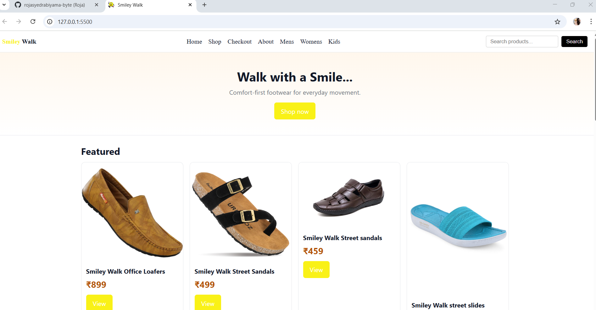
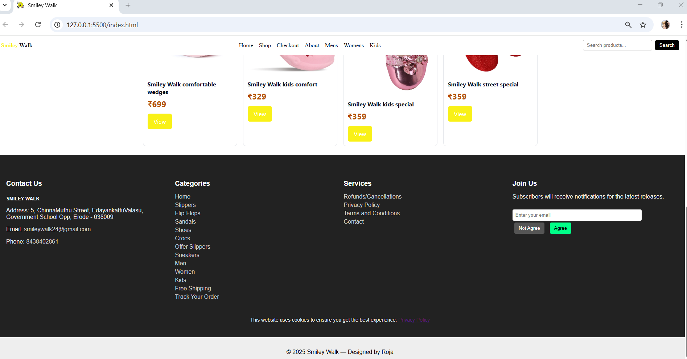
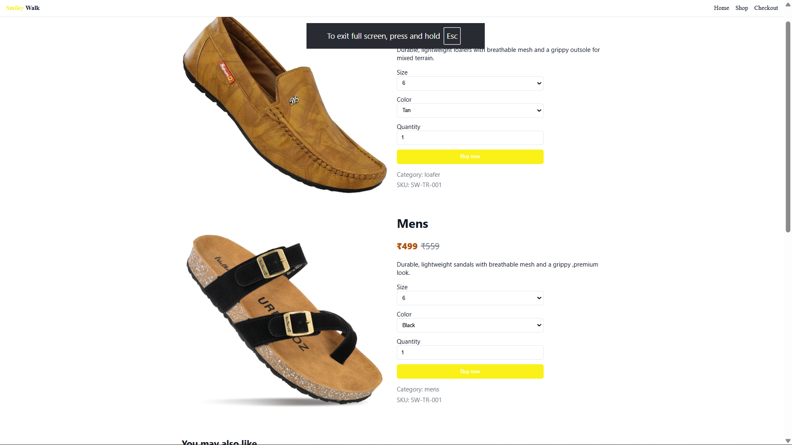
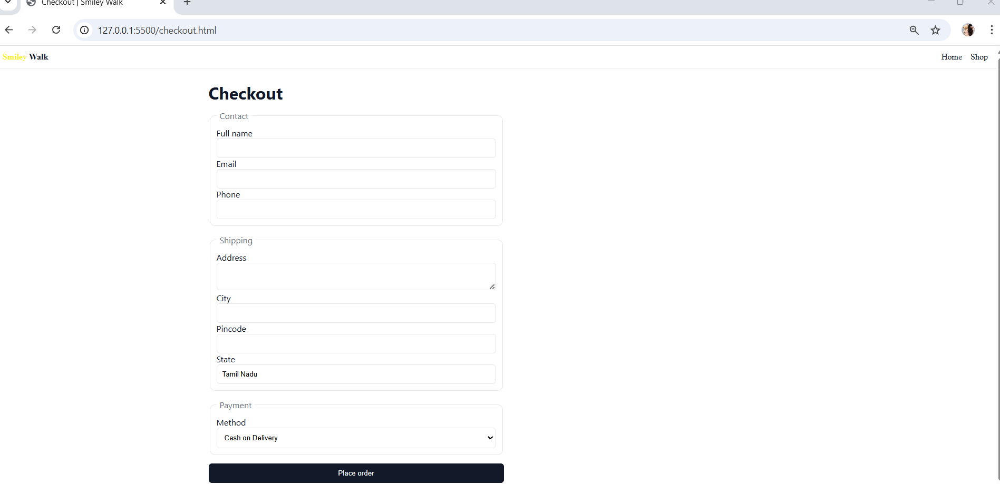

Smiley Walk – Simple E-Commerce Website

Smiley Walk is a basic e-commerce website created using HTML and CSS for my brother’s small footwear business.
It includes clean pages and easy navigation suitable for showcasing footwear products.

📌 Pages Included

Home Page – Overview of the store

Product Page – Displays available footwear

Shop Page – Browse and select items

Checkout Page – Simple order checkout layout

About Page – Details about the business

🛠️ Technologies Used

HTML

CSS

🎯 Features

Simple and clean UI

Beginner-friendly layout

Easy to customize

  
  
  
  
  
  

